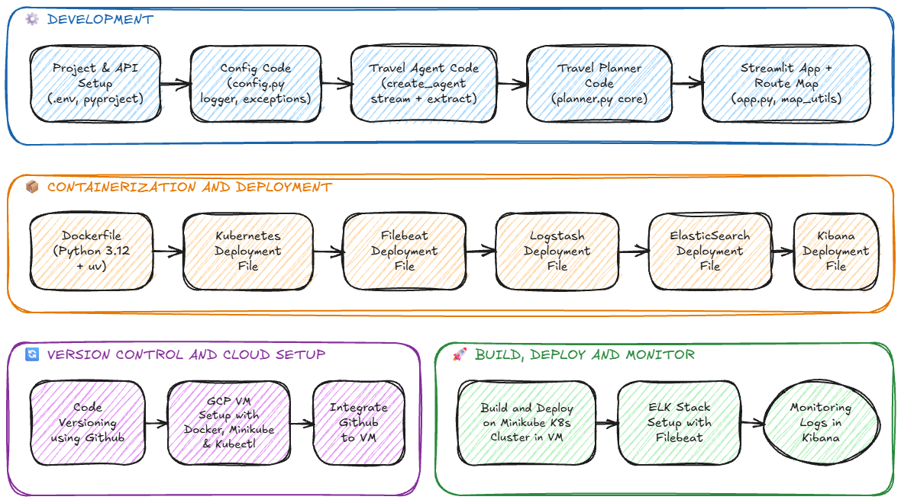
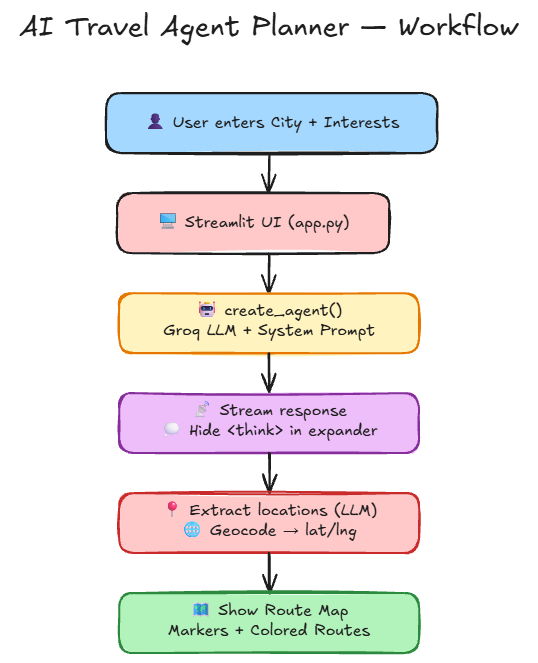

# ✈️ AI Travel Agent Planner

An AI-powered travel planning agent built with **LangChain's `create_agent`** and **Streamlit**. Enter a city and your interests — the agent generates a detailed day trip plan with an **interactive route map**.

## Workflow



## App Flow



## Features

- **AI Agent** — Uses `create_agent` from LangChain (LangGraph-powered)
- **Chat Streaming** — Responses stream token by token in real-time
- **Reasoning Toggle** — AI thinking is hidden behind a collapsible button
- **Route Map** — Interactive Folium map with numbered stops and colored route lines
- **Chat History** — Previous conversations persist in the session

## Tech Stack

- **LLM**: Groq (Qwen 3 32B) via `langchain-groq`
- **Agent**: `langchain.agents.create_agent` (LangChain v1.2.9)
- **Frontend**: Streamlit
- **Maps**: Folium + Geopy (Nominatim geocoding)
- **Logging**: Python `logging` → file-based logs
- **Package Manager**: uv
- **Deployment**: Docker + Kubernetes
- **Monitoring**: ELK Stack (Elasticsearch, Logstash, Kibana, Filebeat)

## Project Structure

```
travel-planner-ai-agent/
├── app.py                        # Streamlit web app (main entry point)
├── main.py                       # CLI entry point
├── pyproject.toml                # Dependencies (managed with uv)
├── Dockerfile                    # Docker container (Python 3.12 + uv)
├── .dockerignore                 # Excludes dev tools from Docker image
├── .env                          # API keys (not committed)
├── .gitignore                    # Git ignore rules
│
├── src/
│   ├── agent/
│   │   └── travel_agent.py      # create_agent setup, streaming, location extraction
│   ├── core/
│   │   └── planner.py           # TravelPlanner class (manages state)
│   ├── config/
│   │   └── config.py            # Environment variable loading
│   └── utils/
│       ├── logger.py            # File-based logging setup
│       ├── custom_exception.py  # Custom exception with file/line info
│       └── map_utils.py         # Geocoding + Folium route map generation
│
├── k8s-deployment.yaml           # Kubernetes deployment + service
├── elasticsearch.yaml            # Elasticsearch for log storage
├── logstash.yaml                 # Logstash pipeline config
├── kibana.yaml                   # Kibana dashboard
├── filebeat.yaml                 # Filebeat log collector (DaemonSet)
│
├── .agent/
│   └── skills/
│       └── excalidraw-diagram-generator/  # Skill for generating diagrams
│
├── workflow.png                  # Project workflow diagram
├── app-flow.png                  # App flow diagram
├── workflow.excalidraw           # Editable workflow (Excalidraw)
```

### ⚠️ Agent Skills

This project uses **[AI agent skills](https://github.com/github/awesome-copilot)** to extend capabilities (e.g., generating Excalidraw diagrams).

**How to install skills:**

```bash
# Browse available skills
npx skills

# Add a specific skill to the project
npx skills add https://github.com/github/awesome-copilot --skill excalidraw-diagram-generator
```

> **Note:** Skills are dev tools only — they are excluded from the Docker image via `.dockerignore` but pushed to GitHub for local development.

## Setup

### 1. Clone and install

```bash
git clone https://github.com/farhanrhine/travel-planner-ai-agent-gcp.git
cd travel-planner-ai-agent-gcp
uv sync
```

### 2. Add your API keys

Create a `.env` file:

```env
GROQ_API_KEY=your_groq_api_key
```

### 3. Run the app

```bash
uv run streamlit run app.py
```

App opens at `http://localhost:8501`

### 4. Run via CLI (optional)

```bash
uv run python main.py
```

## How It Works

1. User enters a **city** and **interests**
2. `create_agent` invokes the Groq LLM with a system prompt
3. Response **streams** token by token — reasoning is hidden behind a toggle
4. After streaming, the AI **extracts location names** from the plan
5. Locations are **geocoded** (Nominatim) and plotted on an **interactive Folium map**

## Docker

```bash
docker build -t travel-agent .
docker run -p 8501:8501 --env-file .env travel-agent
```

## Kubernetes

```bash
kubectl apply -f k8s-deployment.yaml
```

For the ELK logging stack:

```bash
kubectl create namespace logging
kubectl apply -f elasticsearch.yaml
kubectl apply -f logstash.yaml
kubectl apply -f kibana.yaml
kubectl apply -f filebeat.yaml
```
